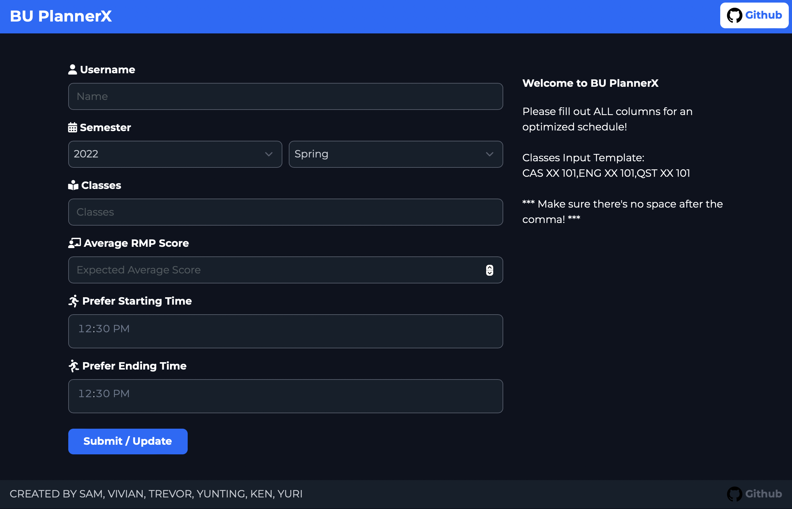

# PlannerX

This is a Python project. So, please check your python version before setup the program. To check python version, simply type `python3 --version` in terminal. Please make sure the version is above 3.6.

Then, to correctly setup the program, please go over the following steps:

1. In the terminal, use the command `cd` to the current PlannerX folder
2. Then, use command `pip3 install -r requirements.txt --user` to check if your machine has all required libraries to run the program. If any of these libraries is not installed in your computer, this command will help you install it.
3. If there is nothing wrong with your libraries, then you are good to run the program! Simply type `python3 web.py` in the terminal to run the website program. If it runs successfully, you should be able to open the website in this link: http://127.0.0.1:1234/. You should see the website looks like the picture below:

