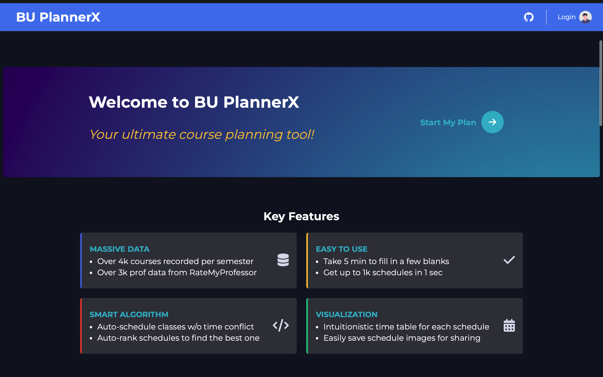

# PlannerX

## Introduction

PlannerX is a website-based program that allows university students to automatically create custom schedules to meet their class requirements and personal preferences. The current version BU PlannerX is made for Boston University students.

## Quick Start

### I. Initialize Environment & Database

If you first run the program, you need to follow the steps below to set up the environment and the database.

1. Check your python version before setup the program. Make sure the version is above 3.6.

   ```
   python --version
   ```
2. In the terminal, switch to the current PlannerX folder.

   ```
   cd /path/to/PlannerX
   ```
3. Install all required libraries.

   ```
   pip install -r requirements.txt --user
   ```
4. Initialize the database needed for the website.

   ```
   python InitDatabase.py
   ```
5. To check your environment and database are correctly set up, try to run the app for now.

   ```
   python web.py
   ```
6. If it runs successfully, you should be able to open the website using this link: [http://127.0.0.1:5000/](http://127.0.0.1:5000/). In your browser, you should see the website looks like this:

   
7. Make sure you terminate the app before you continue the following setup.

### II. Set up a Gmail for User Messages

1. Prepare a Google email, such as "example@gmail.com".
2. In [Google account setting under &#34;Security&#34; tab](https://myaccount.google.com/security), if you have the option _"2-Step Verification"_, continue step 3 below. If you have the option _"Less secure app access"_, continue step 4 below.
3. Click in _"2-Step Verification"_ and turn ON the verification. On the same webpage, scorll down and click in _"App passwords"_. Create a new app password and **record this password** for later use.
4. Click in _"Less secure app access"_ and turn it ON. And then **record your gmail password** for later use.
5. In the PlannerX folder, create a txt file name **_"email.txt"_**. Put your google email address and the password (from step 3 or 4) into this txt file following the format below.

   ```
   example@gmail.com
   mypassword123456
   ```
6. With the setup above, the website should now be able to use your Gmail address to send emails to users.

### III. Create a User Account for Testing

Since the registration function in the website are set with some restrictions, follow the steps below to set up an user account without these limitations.

1. In the terminal, switch to the current PlannerX folder.

   ```
   cd /path/to/PlannerX
   ```
2. Run CreateAccount.py and follow its instructions to create an account. Make sure you use your own email address.

   ```
   python CreateAccount.py
   ```
3. If there is no error when creating your account, you can now run the app to finalize your account setup.

   ```
   python web.py
   ```
4. In the website, try to login with your new account. A webpage for email verification will appear accordingly. Follow the instructions to verify your email, and then you are good to access all website functions!

## Troubleshooting

### Reset Users Data & Database

If you mess up your users data, or the database structure needs to be updated, try the following steps to reset all users data & re-initialize the corresponding database.

1. Make sure you terminate the app before you continue the following steps.
2. In the terminal, switch to the current PlannerX folder.

   ```
   cd /path/to/PlannerX
   ```
3. Run ResetUsers.py to delete all user relevant folders including the database file. After deletion, the program will re-initialize a new database, and you can rerun the app after that.

   ```
   python ResetUsers.py
   ```
4. You might need to recreate a test account following the instructions in Quick Start III.
